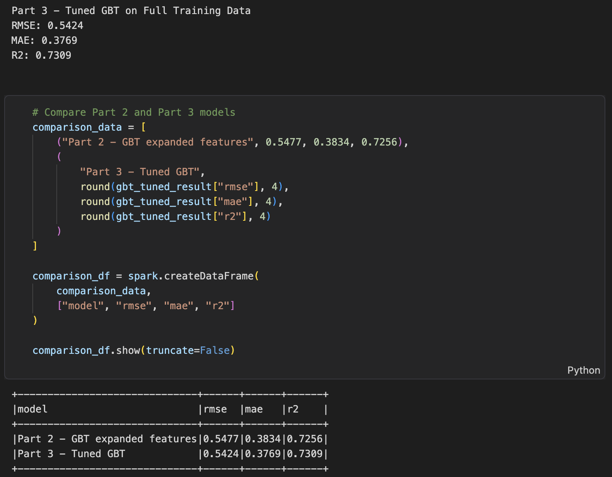
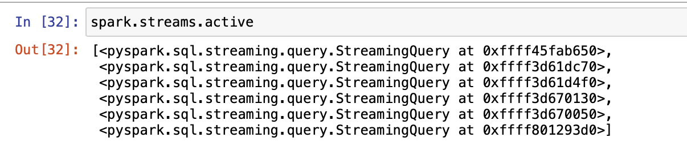
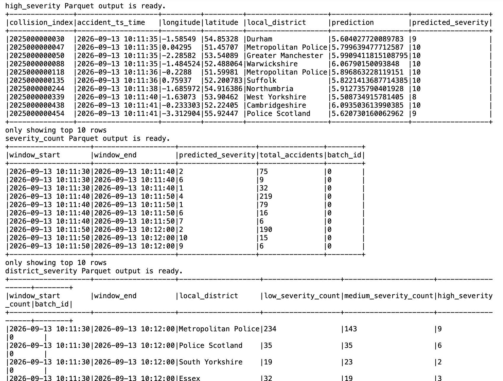
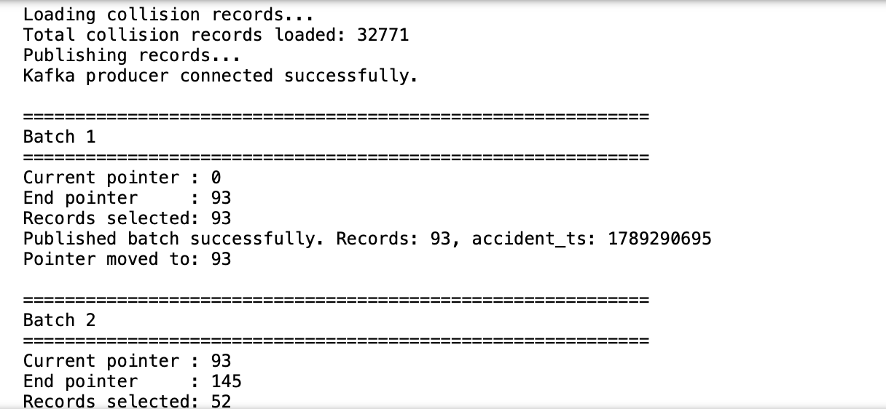
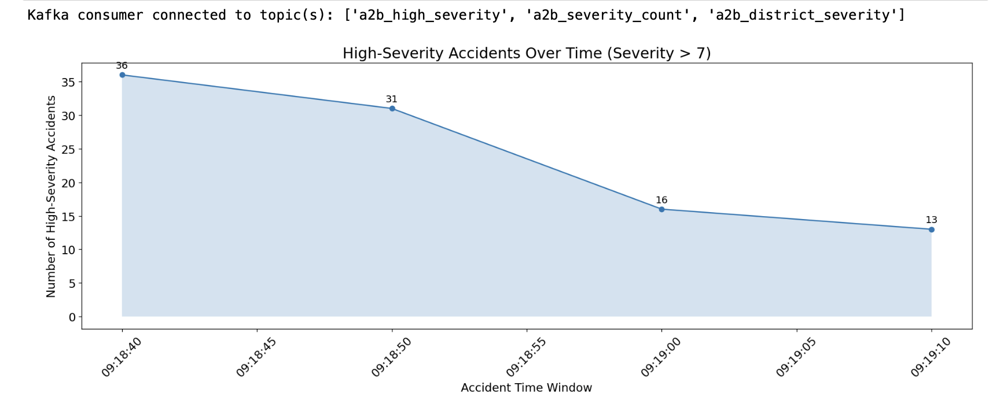
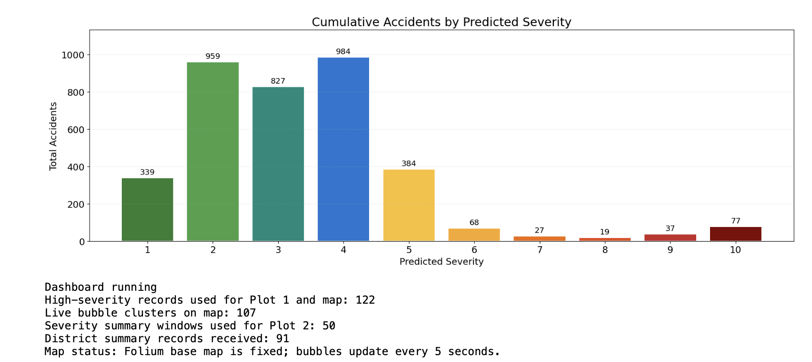
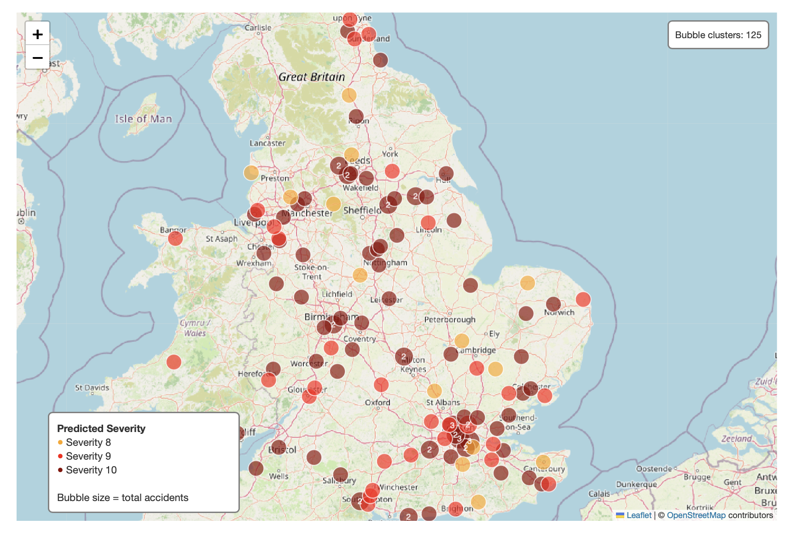

# Real-Time Traffic Accident Analytics with Apache Spark and Kafka

An end-to-end streaming analytics project for predicting and monitoring road accident severity using Apache Spark, Kafka, PySpark ML, and real-time visualisation.

This project combines machine learning with stream processing to simulate incoming road accident events, predict accident severity in real time, aggregate streaming results, and present high-severity incidents through analytical dashboards and an interactive map.

> Academic project developed for FIT5202 Introduction to Big Data, Monash University.

---

## Project Overview

The project consists of two connected stages.

### 1. Accident Severity Model Development

Historical road accident and vehicle data were processed using PySpark to create features for accident severity prediction.

Several modelling approaches were evaluated, and a tuned Gradient-Boosted Trees (GBT) model was selected as the final model.

Final model performance:

| Metric | Result |
| --- | ---: |
| RMSE | 0.5424 |
| MAE | 0.3769 |
| R² | 0.7309 |



### 2. Real-Time Streaming Analytics

The trained model was integrated into a streaming architecture using Apache Kafka and Spark Structured Streaming.

A Kafka producer simulates incoming accident events from 32,771 collision records. Spark consumes the stream, enriches accident records with vehicle-level information, generates additional features, and applies the trained GBT model to predict accident severity.

Streaming results are processed into several analytical outputs, including:

- high-severity accident detection
- severity counts over time windows
- district-level severity summaries
- Parquet outputs for downstream analysis
- Kafka topics for live dashboard consumption

---

## Architecture

```text
Historical Accident + Vehicle Data
                |
                v
       PySpark Data Processing
                |
                v
       Feature Engineering
                |
                v
        GBT Model Training
                |
                v
        Saved ML Pipeline
                |
                |
Collision Stream ---> Kafka Producer
                         |
                         v
                Kafka Accident Topic
                         |
                         v
              Spark Structured Streaming
                         |
              +----------+----------+
              |          |          |
              v          v          v
       ML Prediction  Severity   District
                      Windows    Aggregation
              |          |          |
              +----------+----------+
                         |
                         v
                Kafka / Parquet Outputs
                         |
                         v
                   Kafka Consumer
                         |
                         v
              Dashboard + Live Map
```

---

## Streaming Pipeline

The streaming pipeline consumes accident events from Kafka and performs:

1. schema parsing and timestamp processing
2. integration with static vehicle-level information
3. feature engineering consistent with the training pipeline
4. real-time accident severity prediction
5. high-severity accident filtering
6. window-based severity aggregation
7. district-level severity aggregation
8. publishing results to Kafka and Parquet outputs

Multiple Spark streaming queries run concurrently to support the different analytical outputs.





---

## Kafka Producer

The Kafka producer simulates real-time road accident events by progressively publishing records from the collision dataset.

A total of **32,771 collision records** are available to the producer.



---

## Real-Time Dashboard

The consumer layer reads the processed streaming outputs and presents accident patterns through analytical visualisations.

### High-Severity Accidents Over Time



### Predicted Severity Distribution



### High-Severity Accident Map

An interactive Folium map displays high-severity accident locations and predicted severity levels.



---

## Technologies

- Python
- PySpark
- Apache Spark
- Spark Structured Streaming
- Apache Kafka
- Spark MLlib
- Gradient-Boosted Trees
- Pandas
- Matplotlib
- Folium
- Parquet
- Docker
- Jupyter Notebook

---

## Project Structure

```text
Real-Time-Traffic-Accident-Analytics-Spark-Kafka/
|
├── README.md
├── .gitignore
|
├── notebooks/
│   ├── 01_model_training.ipynb
│   ├── 02_kafka_producer.ipynb
│   ├── 03_spark_streaming_pipeline.ipynb
│   └── 04_kafka_consumer_dashboard.ipynb
|
├── screenshots/
│   ├── model_evaluation.png
│   ├── kafka_producer.png
│   ├── active_streaming_queries.png
│   ├── streaming_prediction.png
│   ├── high_severity_over_time.png
│   ├── severity_distribution.png
│   └── live_accident_map.png
|
└── data/
    └── README.md
```

---

## Notebooks

### `01_model_training.ipynb`

Data preparation, feature engineering, machine learning model development, model evaluation, and hyperparameter tuning.

### `02_kafka_producer.ipynb`

Simulates real-time collision events and publishes accident records to Apache Kafka.

### `03_spark_streaming_pipeline.ipynb`

Processes Kafka events using Spark Structured Streaming, performs feature enrichment and real-time severity prediction, and generates streaming analytical outputs.

### `04_kafka_consumer_dashboard.ipynb`

Consumes processed streaming results and produces analytical charts and an interactive accident severity map.

---

## Data

The datasets used in this project are not included in this repository.

Dataset access and redistribution depend on the original source and licensing conditions.

The data was used for:

- accident severity model development
- vehicle-level feature enrichment
- simulated real-time collision streaming
- severity prediction and aggregation
- dashboard and geospatial visualisation

See [`data/README.md`](data/README.md) for additional information.

---

## Key Outcomes

This project demonstrates an end-to-end big data workflow combining:

**Machine Learning → Event Streaming → Distributed Processing → Real-Time Analytics → Visualisation**

It demonstrates practical experience with Spark Structured Streaming, Kafka, PySpark ML, concurrent streaming queries, data pipelines, and real-time analytical visualisation.